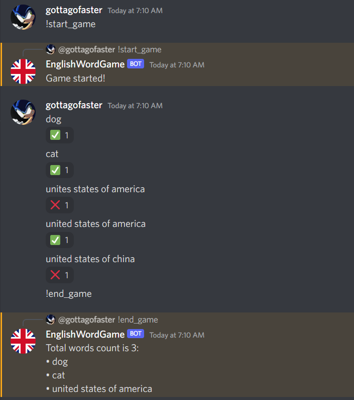

This is a bot for Discord that allows you to play a word game in teams.

The idea is that the moderators of the game (their roles are specified in [managing_roles.txt](./managing_roles.txt) on separate lines)
choose a topic, then split the participants into channels. Then the moderators announce the topic
and write a "!start\_game" command to every channel. 
Every team then tries to come up with as many words matching the topic. When the time runs out,
the moderators write an "!end\_game" command and check the words. The team that had the most
correct words wins the round.

You'll have to host the bot yourself if you want to use it. You'll have to fill in the [token.txt](./token.txt) file with a token, read [here](https://discordpy.readthedocs.io/en/stable/discord.html) on how to get one.